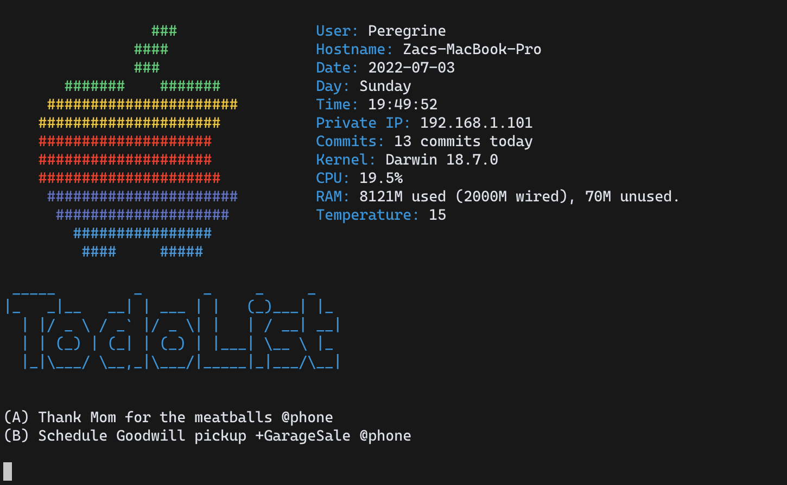
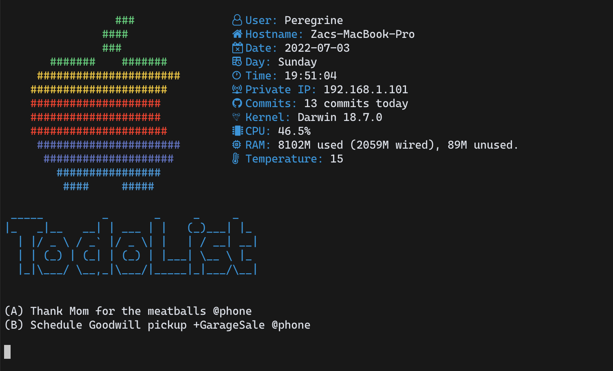

# Stats

A bash script inspired by archey-osx before I realised fetch scripts were a thing!  

Big thanks to [archey-osx](https://github.com/obihann/archey-osx), learnt a ton from this project.  

Things you'll need to change before use:
```
1. Line 26 - replace TechWiz-3 with your github username
2. Line 27 - replace Sydney with your city name
3. Use a nerd font if you wish to use the icons option 
4. Add your own items in todo.txt
``` 

## Install
`make install`  

`todo.txt` is in `~/.wise-todo/todo.txt`  

## Screenshots



